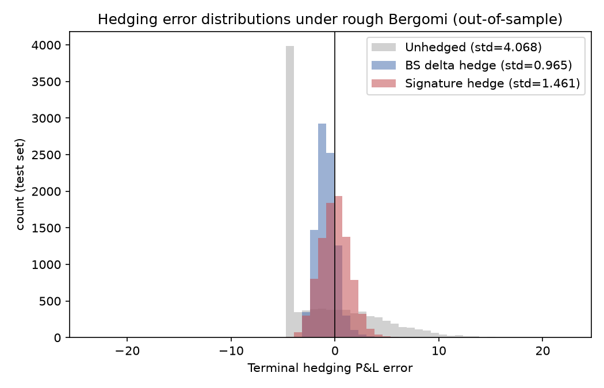

# Hedging sous volatilité rugueuse par régression linéaire sur signatures de chemin

**Langage : Python** (numpy/scipy/matplotlib uniquement, aucune librairie de
signature externe type `iisignature`/`esig` : j'ai réimplémenté le calcul à
la main pour que l'algèbre reste transparente).

## 1. Question de recherche

Sous un modèle de volatilité rugueuse (rough Bergomi), la volatilité
instantanée n'est pas markovienne dans le prix : elle dépend de toute la
trajectoire passée du bruit qui la pilote. Un delta Black-Scholes classique
`Δ(t, S_t)` ne voit, par construction, que l'état courant `(t, S_t)`, donc
il ne peut pas exploiter l'information contenue dans la forme du chemin
déjà parcouru. La signature de chemin est l'objet mathématique qui sert à
encoder cette forme : toute fonctionnelle continue du chemin peut être
approchée arbitrairement bien par une fonction linéaire de sa signature
(Lyons & McLeod 2022). La question empirique que je pose ici :

> Un delta linéaire dans la signature du chemin de prix peut-il réduire la
> variance de couverture hors échantillon, par rapport à un delta
> Black-Scholes à volatilité constante, lorsque le monde réel est
> rugueux/non-markovien ?

## 2. Méthodologie

### 2.1 Modèle de marché, `rough_bergomi.py`
Simulation du modèle rough Bergomi (Bayer, Friz & Gatheral 2016) :

```
W^H_t = √(2H) ∫₀ᵗ (t−s)^{H−1/2} dZ_s        (fBm de Riemann-Liouville)
V_t   = ξ₀ exp(η W^H_t − ½η²t^{2H})
dS_t  = S_t √(V_t) dB_t ,   dB_t = ρ dZ_t + √(1−ρ²) dZ'_t
```

avec `H = 0.10` (rugosité empirique, Gatheral–Jaisson–Rosenbaum 2018) et
`ρ = −0.7` (effet de levier). L'intégrale de Volterra est discrétisée par
une somme de Riemann à gauche sur les incréments browniens, ce qui est
l'approximation standard dans la littérature (biais O(√Δt), sans
singularité puisqu'on ne l'évalue jamais au point coïncident). Le
raffinement naturel pour de longues grilles serait le hybrid scheme de
Bennedsen, Lunde et Pakkanen (2017).

### 2.2 Moteur de signature, `signature.py`
Implémentation vectorisée (batch sur tous les chemins Monte Carlo à la
fois) de la signature tronquée, construite directement sur l'identité de
Chen : la signature d'un segment linéaire d'incrément `δ` est son
exponentielle tensorielle tronquée `Σ δ^{⊗k}/k!`, et la concaténation de
deux chemins multiplie leurs signatures (produit tensoriel). Les tenseurs
d'ordre `k` sont stockés aplatis en vecteurs de `R^{d^k}` (convention
row-major), ce qui ramène tout le calcul à des produits extérieurs batch.
J'ai validé ça numériquement contre le cas fermé (`signature.py` en
exécution directe redonne bien `t^k/k!` à la précision machine pour la
droite `t ↦ t`).

### 2.3 Couverture linéaire-en-signature, `hedge_experiment.py`
En suivant Lyons, Nejad & Perez Arribas (2020) : on pose que la quantité
d'actif détenue sur `[t_i, t_{i+1})` est linéaire dans la signature du
chemin observé jusqu'à `t_i` : `θ_i = ⟨ℓ, Sig(X)_{[0,t_i]}⟩`. Le P&L de
couverture s'écrit alors

```
P&L_j = V₀ + Σᵢ θ_{i,j}(S_{t_{i+1},j} − S_{t_i,j}) = V₀ + ℓ · R_j
```

où `R_j = Σᵢ Sig(X)_{[0,t_i],j} · ΔS_{i,j}` est un seul vecteur de features
par chemin. Minimiser l'erreur quadratique de couverture devient alors une
régression linéaire ordinaire (ridge, avec standardisation des colonnes
car les niveaux de signature ont des échelles très différentes), sans
programmation dynamique ni réseau de neurones, mais avec une couverture
qui reste non-linéaire et véritablement dépendante du chemin grâce à la
richesse de la signature elle-même (une sorte de "deep hedging" convexe et
à solution fermée).

Le benchmark est une couverture delta Black-Scholes classique à
volatilité constante `σ = √ξ₀`, ce que ferait un praticien raisonnable qui
refuse de spécifier un modèle de vol stochastique complet.

## 3. Résultats (out-of-sample, 30 000 chemins, 70/30 train/test)

Call ATM, `T = 3 mois`, `S₀ = K = 100`, `ξ₀ = 0.04` (vol ATM ≈ 20 %),
`H = 0.10`, `η = 1.5`, `ρ = −0.7`, signature niveau 4 (30 features),
50 rebalancements.

| Stratégie              | écart-type erreur | réduction de variance vs non couvert |
|-------------------------|-------------------:|---------------------------------------:|
| Non couvert             | 4.068              | n/a                                     |
| Delta Black-Scholes     | **0.965**          | 94.4 %                                  |
| Linéaire-en-signature   | 1.461              | 87.1 %                                  |



Le delta Black-Scholes classique bat la couverture linéaire-en-signature
sur ce call vanille ATM court terme, et ce résultat tient : un balayage du
niveau de troncature (2 à 4) et du paramètre de ridge (voir l'historique
de développement) ne change pas la conclusion, et le delta BS reste très
stable même quand on désaccorde volontairement sa volatilité
(`σ = 0.10` à `0.25`, écart-type toujours entre 0.95 et 1.12).

## 4. Pourquoi, et où la signature aurait l'avantage

Ce n'est pas vraiment un résultat négatif surprenant, il est cohérent avec
la littérature. Pour une option vanille européenne proche de la monnaie
et à courte maturité, le delta Black-Scholes est déjà quasi-optimal : la
sensibilité de son P&L de couverture à la forme précise du chemin de
volatilité (au-delà du niveau de spot courant) reste un effet de second
ordre. La couverture linéaire-en-signature, elle, agrège toute
l'information du chemin en un coefficient global unique partagé par tous
les pas de temps, ce qui la rend structurellement plus rigide qu'une
fonction delta déjà non-linéaire et paramétrique en `(t, S_t)`.

Les papiers qui montrent un vrai gain de la signature (Lyons-Nejad-Perez
Arribas 2020 en particulier) l'utilisent sur des payoffs path-dependent
(barrières, options asiatiques) pour lesquels il n'existe pas de delta
fermé simple, c'est là que l'absence d'hypothèse de modèle paye vraiment.
Ce que je ferais si je reprenais ce projet : remplacer le call vanille par
un up-and-out, où le benchmark naturel (delta BS du vanille en ignorant
la barrière) est une heuristique de praticien beaucoup plus fragile, et
où le niveau 2 de la signature (aire de Lévy / variation quadratique)
encode justement l'information de trajectoire pertinente pour anticiper
un franchissement de barrière.

## 5. Structure du projet

```
.
├── README.md
├── requirements.txt
├── signature.py              # moteur de signature tronquée (identité de Chen), vectorisé
├── rough_bergomi.py           # simulation du modèle rough Bergomi
├── hedge_experiment.py        # expérience principale + graphique
└── hedging_error_distributions.png   # généré par hedge_experiment.py
```

Reproduire les résultats :
```
pip install -r requirements.txt
python hedge_experiment.py
```

## 6. Sources

- Lyons & McLeod, *Signature Methods in Machine Learning*, arXiv:2206.14674
- Lyons, Nejad & Perez Arribas, *Non-parametric pricing and hedging of exotic
  derivatives*, Applied Mathematical Finance 27(6), 2020, arXiv:1905.01345
- Abi Jaber & Gérard, *Hedging with memory: shallow and deep learning with
  signatures*, 2025, arXiv:2508.02759
- Bayer, Friz & Gatheral, *Pricing under rough volatility*, Quantitative
  Finance 16(6), 2016
- Gatheral, Jaisson & Rosenbaum, *Volatility is Rough*, Quantitative Finance
  18(6), 2018, arXiv:1410.3394
- Bennedsen, Lunde & Pakkanen, *Hybrid scheme for Brownian
  semistationary processes*, Finance and Stochastics 21, 2017
