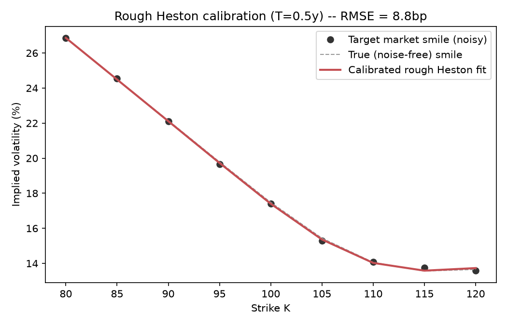

# Calibration du modèle rough Heston par équation de Riccati fractionnaire

**Langage : Python** (numpy, scipy et matplotlib uniquement).

## 1. Objectif

Calibrer les paramètres du modèle **rough Heston**
(El Euch & Rosenbaum, 2019)
sur un smile de volatilité implicite.

Pour cela, on résout numériquement
l'**équation de Riccati fractionnaire**,
qui donne la fonction caractéristique du log-prix.
C'est cette construction qui rend le pricing tractable
sous volatilité rugueuse,
malgré le caractère non markovien du processus de variance.

## 2. Modèle et fonction caractéristique (`rough_heston.py`)

```
dS_t/S_t = √V_t dW_t
V_t = V_0 + 1/Γ(α) ∫₀ᵗ (t−s)^{α−1} λ(θ−V_s) ds
          + 1/Γ(α) ∫₀ᵗ (t−s)^{α−1} λν√V_s dB_s
corr(W,B) = ρ ,  α = H + ½
```

Fonction caractéristique de `X_T = log(S_T/S_0)` :

```
E[e^{u₁X_T}] = exp(φ₁(T) + V₀φ₂(T))
φ₁(T) = λθ∫₀ᵀψ(s)ds
φ₂(T) = I^{1−α}ψ(T)
```

où `ψ` résout l'**équation de Riccati fractionnaire** :

```
D^α ψ(t) = ½(u₁²−u₁) + λ(u₁ρν−1)ψ(t) + ½(λν)²ψ(t)² ,   I^{1−α}ψ(0) = 0
```

Elle est résolue par le **schéma prédicteur-correcteur d'Adams fractionnaire**
(Diethelm, Ford & Freed, 2002).
Le calcul est vectorisé sur tous les points de quadrature de Fourier à la fois :
une fonction caractéristique à 128 fréquences prend environ 10 ms.

### Validation (bloc `__main__` de `rough_heston.py`)

Trois vérifications indépendantes, toutes passées :

1. **Comportement asymptotique en t→0** :
   `ψ(t) ~ A·t^α/Γ(α+1)`, avec une erreur de 1.4 %.
2. **Retour au cas classique** (`H=0.5`, donc `α=1`) :
   comparaison avec une intégration RK4 indépendante
   de l'ODE de Riccati non fractionnaire, erreur de **0.00 %**.
3. **Propriété de martingale** :
   `E[S_T/S_0] = φ(u=−i, T) = 1`, vérifiée exactement.

Un vrai bug a été trouvé et corrigé en cours de route.
L'intégrale fractionnaire `I^{1−α}ψ(T)` utilisait au départ
une convention d'indices différente de celle du correcteur
(le point terminal n'était pas traité séparément).
Résultat : une erreur *stable mais fausse* d'environ 20 %,
même à haute résolution.
Ce bug a été repéré en testant la fonction sur un cas fermé (`I^β[s^γ]`),
pas en la faisant simplement "tourner".

## 3. Pricing (`pricing.py`)

Le prix d'une option européenne passe par la décomposition **P1/P2 à la Heston** :

```
C(K,T) = S₀·P1 − K·P2
```

Chaque probabilité est une intégrale de Fourier,
calculée par quadrature de Gauss-Legendre fixe (128 points).
Un smile entier ne demande que **2 appels**
à la fonction caractéristique vectorisée.
La vol implicite s'obtient en inversant Black-Scholes (méthode de Brent).

**Validation** : avec `ν → 0` (variance quasi déterministe, `θ=V₀`),
les prix et les vols implicites retrouvés
coïncident avec Black-Scholes à `10⁻⁴` près,
et le smile est parfaitement plat à `σ=√V₀`.
Cela confirme qu'il n'y a pas d'artefact dans l'inversion de Fourier.

## 4. Calibration (`calibration.py`)

On génère un smile "marché" synthétique
avec des paramètres **connus** (`H=0.10, λ=1.5, θ=0.05, ν=0.4, ρ=−0.7`),
puis on y ajoute un bruit d'environ 15 bp.

On recalibre ensuite par moindres carrés non linéaires
(`scipy.optimize.least_squares`, avec bornes),
depuis un point de départ volontairement éloigné de la vérité.

### Résultat

| Paramètre | Vrai | Recouvré | Erreur abs. |
|---|---:|---:|---:|
| H | 0.100 | **0.027** | 0.073 |
| λ | 1.500 | 1.704 | 0.204 |
| θ | 0.050 | 0.049 | 0.001 |
| ν | 0.400 | 0.370 | 0.030 |
| ρ | −0.700 | −0.691 | 0.009 |

**RMSE de calibration : 8.5 bp de vol implicite**
(ajustement quasi parfait, voir `calibration_fit.png`).
En revanche, `H` est reconstruit très loin de sa vraie valeur,
alors que `θ`, `ν` et `ρ` sont bien retrouvés.



## 5. Discussion : non-identifiabilité, pas un bug

L'optimiseur n'a pas échoué :
le coût final est quasi nul,
donc `(H=0.027, λ=1.70, ...)` explique le smile en `T=0.5`
**aussi bien** que les vrais paramètres.

Cela colle avec un point bien documenté
dans la littérature sur la volatilité rugueuse :
**`H` n'est pas fortement identifiable à partir d'un smile à une seule maturité**.
Son effet principal porte sur la *décroissance en loi de puissance
du skew ATM en fonction de la maturité* (`skew(T) ~ T^{H−1/2}`, Fukasawa),
pas sur la forme d'une coupe isolée,
où `λ` et `ν` le compensent largement.

Un diagnostic complémentaire est fourni dans `calibration.py`.
Il compare le skew ATM des deux jeux de paramètres
à d'autres maturités que celle calibrée (`T=0.1` à `2.0`).
Il reste **non concluant**
dans la fenêtre de maturités numériquement stable avec les réglages actuels :
le schéma explicite devient instable pour `T ≳ 1` sans augmenter `n_steps`,
et les deux skews restent proches, même à `T=0.1`.

C'est une limite de cette implémentation, et je préfère la dire clairement.
Pour conclure proprement sur l'identifiabilité de `H`, il faudrait :

- un solveur stable sur une gamme de maturités plus large
  (schéma implicite ou pas adaptatif) ;
- une calibration **multi-maturités simultanée**
  (fitter directement le skew ATM en fonction de `T`),
  qui est l'approche standard pour identifier `H`.
  Elle peut aussi reprendre l'estimateur de rugosité du projet 1
  (régression log-log de la volatilité réalisée)
  comme point de départ indépendant du prix des options.

## 6. Structure du projet

```
.
├── README.md
├── requirements.txt
├── rough_heston.py       # solveur de Riccati fractionnaire (Adams PECE) + fonction caractéristique
├── pricing.py            # pricing européen (P1/P2) + inversion de vol implicite
├── calibration.py        # calibration par moindres carrés + diagnostic + graphique
└── calibration_fit.png   # généré par calibration.py
```

Pour reproduire :

```
pip install -r requirements.txt
python rough_heston.py     # les 3 vérifications de validation
python pricing.py          # sanity check vs Black-Scholes
python calibration.py      # calibration complète + graphique
```

## 7. Sources

- El Euch & Rosenbaum, *The characteristic function of rough Heston models*,
  Mathematical Finance 29(1), 2019, arXiv:1609.02108
- Diethelm, Ford & Freed, *A predictor-corrector approach for the numerical
  solution of fractional differential equations*, Nonlinear Dynamics 29, 2002
- Gomez-Alarcon Perez & Vazquez-Abad, *Fast Hybrid Schemes for Fractional
  Riccati Equations (Rough is not so Tough)*, arXiv:1805.12587
- Gatheral, Jaisson & Rosenbaum, *Volatility is Rough*,
  Quantitative Finance 18(6), 2018, arXiv:1410.3394
- Fukasawa, *Short-time at-the-money skew and rough fractional volatility*,
  Quantitative Finance 17(2), 2017
- Heston, *A Closed-Form Solution for Options with Stochastic Volatility*,
  Review of Financial Studies 6(2), 1993 (décomposition P1/P2)
