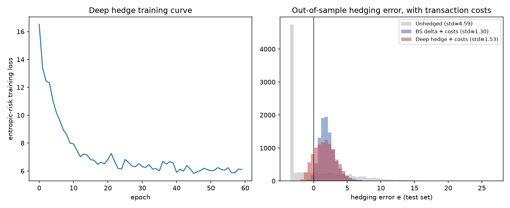

# Deep Hedging sous coûts de transaction (réseaux de neurones from-scratch)

**Langage : Python** (numpy uniquement).
Le réseau de neurones et la rétropropagation sont codés à la main,
sans framework d'autodiff,
pour les mêmes raisons de transparence que dans les 2 premiers projets.

## 1. Objectif

Buehler, Gonon, Teichmann & Wood (2019) proposent d'entraîner directement
une **stratégie de couverture** (un réseau de neurones par date de rebalancement).
Elle minimise une **mesure de risque convexe** de l'erreur de couverture terminale,
au lieu de calculer un Grec fermé.

L'intérêt est maximal quand un Grec fermé n'est **pas** la bonne réponse.
C'est le cas ici, avec des **coûts de transaction proportionnels** :
la stratégie optimale dépend en principe de tout l'historique de trading,
pas seulement de l'état courant.
Un delta Black-Scholes recalculé à chaque pas ignore totalement le coût de le faire.

## 2. Méthodologie

### 2.1 Réseau et rétropropagation (`nn.py`)

Un petit MLP :

- 2 couches cachées `tanh` ;
- une sortie `sigmoid` bornée dans [0,1]
  (le ratio de couverture d'un call vit naturellement dans cet intervalle).

Le forward et le backward sont écrits à la main.
L'optimiseur **Adam** est lui aussi codé de zéro
(formules standard de Kingma & Ba 2014).

**Validation** : test de gradient par différences finies centrées sur quelques poids,
erreur relative maximale **5×10⁻⁸**.

### 2.2 Boucle d'entraînement (`deep_hedging.py`)

Un réseau **indépendant** par pas de temps
(architecture non récurrente de l'article original),
avec en entrée `(temps à maturité, log-moneyness)`.

La fonction de perte est le **risque entropique** :

```
ρ_λ(e) = (1/λ) log E[exp(λe)]
e = payoff − (p₀ + gains de couverture − coûts)
```

Elle est convexe, monotone et invariante par translation.
La prime `p₀` est **fixée** à la moyenne Monte-Carlo du payoff
(juste sous la dynamique risque-neutre déjà simulée),
elle n'est pas optimisée conjointement.
Une optimisation conjointe serait une direction dégénérée
(`∂ρ_λ/∂p₀ = −1` identiquement : on voudrait toujours facturer plus).
Seule la formulation à prime fixe de Buehler et al. est donc implémentée.

**Point technique le plus délicat, et un vrai bug trouvé en cours de route.**
Les coûts de transaction couplent deux pas de temps consécutifs :
`coût_i` dépend de `θᵢ` et `θᵢ₋₁`,
`coût_{i+1}` dépend de `θᵢ` et `θᵢ₊₁`.
Donc `∂Loss/∂θᵢ` a deux contributions, pas une.

Ma première implémentation allait plus loin :
elle utilisait aussi `θᵢ₋₁` comme **feature d'entrée** du réseau suivant.
Cela créait une vraie récurrence dans le graphe de calcul,
que ma passe *backward* ignorait.

Le test de gradient bout-en-bout l'a détecté immédiatement :
une erreur systématique de 6,5 %, identique sur plusieurs poids.
C'est la signature d'un terme manquant, pas d'un bruit numérique.

Plutôt que d'implémenter une BPTT complète,
j'ai choisi la solution la plus sûre :
retirer `θᵢ₋₁` de l'entrée (état purement markovien en `(t, S_t)`),
ce qui élimine proprement la récurrence.
C'est documenté comme limite assumée du projet (§4), pas masqué.

**Validation** : différences finies sur la perte totale
(forward complet → risque entropique → backward complet),
pour un poids d'un réseau à un pas de temps **intérieur**
(le plus exposé au couplage à deux coûts).
Erreur relative de **6×10⁻⁸** après correction.

### 2.3 Marché (`rough_bergomi.py`)

Réutilisation du simulateur rough Bergomi validé du projet 1
(`H=0.15`, `η=1.3`, `ρ=−0.7`),
pour tester la couverture sous un régime de volatilité non markovien
plutôt que sous Black-Scholes.

## 3. Résultats

Hors échantillon, 40 000 chemins, 30 pas,
coût = 100 bp de notional par unité de turnover,
`T = 3 mois`, call ATM, `λ = 8`.

| Stratégie | moyenne(e) | std(e) | **risque entropique** | CVaR 95% |
|---|---:|---:|---:|---:|
| Non couvert | 0.04 | 4.59 | 25.48 | 12.22 |
| Delta BS + coûts | 2.10 | **1.30** | 15.12 | 5.67 |
| **Deep hedge + coûts** | **1.52** | 1.58 | **8.51** | **4.90** |



Le delta BS a un écart-type **plus faible** (il suit le payoff de plus près),
mais un **risque entropique 44 % plus élevé**.
Il recalcule un delta complet à chaque pas
sans jamais tenir compte du coût de le faire, et il sur-trade.
La moyenne de l'erreur (2.10) le montre.

Le réseau est entraîné directement sur le risque entropique.
Il apprend à **accepter plus de variance pour réduire le coût moyen de friction**.
C'est exactement l'arbitrage mis en avant par Buehler et al. :
sous coûts, *la bonne métrique n'est pas la variance de suivi,
c'est le risque net après frictions*,
et un delta fermé ne peut pas l'internaliser.

**Test de cohérence sans coûts** (`cost_rate=0`) :
le delta BS reste meilleur en écart-type pur (1.02 contre 1.46),
ce qui est cohérent avec le résultat du projet 1.
Le deep hedge garde pourtant un risque entropique plus bas (5.59 contre 10.56).
C'est attendu : il est entraîné directement sur cette métrique,
alors que le delta BS ne l'est pas.
Il s'agit d'un résultat de cohérence interne, pas d'une preuve d'optimalité générale.

## 4. Limites assumées

- **Pas de conditionnement sur la position précédente** dans l'entrée du réseau (§2.2).
  La stratégie apprise ne peut pas distinguer explicitement
  "je suis déjà à 0.6, petit ajustement nécessaire" de "je pars de zéro".
  Extension naturelle : réintroduire `θᵢ₋₁` en entrée, avec une vraie BPTT.
- **Pas de décroissance du taux d'apprentissage** :
  la courbe d'entraînement oscille en fin d'optimisation
  (`deep_hedging_results.png`, à gauche).
  Un simple *learning rate schedule* stabiliserait la fin de l'entraînement.
- **`λ` (aversion au risque) fixé arbitrairement à 8.**
  Une étude de sensibilité (frontière risque-coût en fonction de `λ`)
  serait la suite naturelle.

## 5. Structure du projet

```
.
├── README.md
├── requirements.txt
├── nn.py                       # MLP + Adam from scratch, gradient check
├── rough_bergomi.py            # simulateur (repris et revalidé du projet 1)
├── deep_hedging.py             # entraînement + backprop à travers les coûts, gradient check bout-en-bout
├── experiment.py               # expérience principale + graphiques
└── deep_hedging_results.png    # généré par experiment.py
```

Pour reproduire :

```
pip install -r requirements.txt
python nn.py               # gradient check du MLP seul
python deep_hedging.py     # gradient check bout-en-bout (couplage des coûts)
python experiment.py       # entraînement complet + résultats + graphique
```

## 6. Sources

- Buehler, Gonon, Teichmann & Wood, *Deep Hedging*,
  Quantitative Finance 19(8), 2019, arXiv:1802.03042
- Kingma & Ba, *Adam: A Method for Stochastic Optimization*,
  ICLR 2015, arXiv:1412.6980
- Bayer, Friz & Gatheral, *Pricing under rough volatility*,
  Quantitative Finance 16(6), 2016 (marché de simulation, repris du projet 1)
