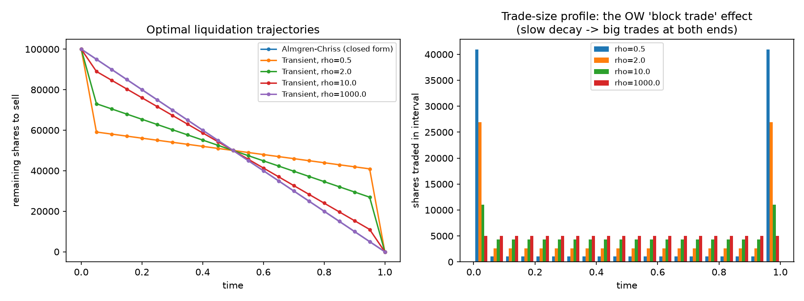
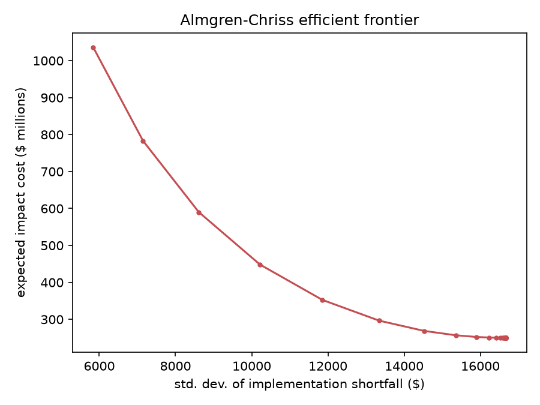

# Exécution optimale sous impact de marché transitoire

**Langage : Python** (numpy uniquement — le problème est un programme
quadratique à contrainte linéaire, résolu directement par algèbre
linéaire via son système KKT, sans solveur QP externe).

## 1. Objectif

Implémenter la solution fermée d'**Almgren & Chriss (2001)** pour la
liquidation optimale sous impact de marché linéaire, puis l'étendre à
un **impact transitoire** (à décroissance exponentielle, à la
**Obizhaeva & Wang 2013** / **Gatheral 2010**), où l'effet d'un trade
ne s'efface pas instantanément avant le suivant.

Ça couple tous les instants de trading entre eux, et ça change
qualitativement la forme de la trajectoire optimale.

## 2. Modèle — `execution.py`

Liquidation de `X` actions sur `[0,T]` en `N` intervalles de longueur
`τ=T/N`. `n_k` = quantité tradée sur l'intervalle `k`,
`x_k` = position restante.

Coût d'impact, sous forme quadratique générale dans le vecteur de
trades `n` :

```
Coût_impact(n) = ½ nᵀ K n
```

- **Almgren-Chriss** : `K = diag(η/τ)`, chaque trade ne coûte que
  contre lui-même (l'impact s'efface totalement avant le trade
  suivant).
- **Obizhaeva-Wang / Gatheral** : `K_{jk} = κ₀·exp(−ρ|t_j−t_k|)`,
  noyau de Toeplitz exponentiel. L'impact d'un trade décroît, mais
  persiste partiellement au moment des trades suivants.

Risque (variance du coût dû à la détention d'une position résiduelle
volatile) :

```
Var(n) = σ²τ·‖Xe − Ln‖²
```

où `L` est la matrice de somme cumulée. L'objectif moyenne-variance,

```
J(n) = ½nᵀKn + λσ²τ‖Xe−Ln‖²,   sous 1ᵀn = X
```

est un QP convexe à contrainte d'égalité linéaire. Sa solution découle
directement de son **système KKT**, résolu en un seul
`np.linalg.solve` — aucun solveur QP externe n'est nécessaire, quel
que soit le noyau `K` (diagonal ou transitoire).

### Validations (bloc `__main__` d'`execution.py`)

1. **Avec noyau diagonal**, le solveur QP général retombe exactement
   sur la trajectoire fermée `x_j = X·sinh(κ(T−t_j))/sinh(κT)`
   d'Almgren-Chriss, erreur maximale **2×10⁻⁷** (en fraction de X).
2. **Limite risque-neutre** (`λ=0`) : trading parfaitement uniforme
   (TWAP), exact (Cauchy-Schwarz : minimiser `Σn_k²` sous `Σn_k=X` est
   résolu par `n_k=X/N`).
3. **Noyau transitoire, `ρ→∞`** (décroissance instantanée) : converge
   vers la solution Almgren-Chriss diagonale, écart relatif
   `5.95 → 1.20 → 0.006 → 0.00` en faisant croître `ρ` de 1 à 10⁴.

## 3. Résultat principal — le phénomène des "block trades" d'Obizhaeva-Wang

Sans jamais le coder explicitement, le solveur QP général fait émerger
la prédiction qualitative la plus connue de la théorie OW en temps
continu.

Sous impact **persistant** (`ρ` faible), la trajectoire optimale
place de **gros trades aux deux extrémités** de la fenêtre
d'exécution, avec un trading quasi-uniforme, et beaucoup plus fin,
entre les deux.

| ρ (décroissance) | 1er trade en % de X | référence TWAP |
|---:|---:|---:|
| 0.5 (très persistant) | **40.9 %** | 5.0 % |
| 2.0 | 26.9 % | 5.0 % |
| 10.0 | 11.0 % | 5.0 % |
| 1000.0 (quasi instantané) | 5.0 % | 5.0 % |



**Intuition** : avec un impact persistant, trader au milieu de la
fenêtre est mauvais, l'impact des trades précédents n'a pas eu le
temps de s'estomper, donc chaque unité tradée y coûte plus cher.

Il vaut mieux concentrer le volume aux deux bords : au tout début
(avant qu'aucun impact ne se soit accumulé), et tout à la fin
(l'impact accumulé n'a plus le temps de peser sur des trades futurs).

## 4. Coût de la mauvaise spécification du modèle

Appliquer la trajectoire Almgren-Chriss (qui suppose un impact sans
mémoire) sous le **vrai** noyau transitoire coûte structurellement
plus cher que la trajectoire correctement optimisée pour ce noyau :

| ρ | coût (trajectoire correcte) | coût (trajectoire AC, mal spécifiée) | surcoût |
|---:|---:|---:|---:|
| 0.5 | 4.04 Md$ | 4.26 Md$ | **+5.5 %** |
| 2.0 | 2.57 Md$ | 2.84 Md$ | **+10.9 %** |
| 10.0 | 0.88 Md$ | 0.92 Md$ | +4.3 % |
| 1000.0 | 0.25 Md$ | 0.25 Md$ | +0.0 % |

(Ordres de grandeur volontairement élevés, `X=100 000` actions avec un
`κ₀` calibré pour rendre l'effet lisible. Ce qui compte, c'est le
**surcoût relatif**, pas le montant absolu.)

Le surcoût n'est pas monotone en `ρ` (pic vers `ρ=2`) : à `ρ` très
faible, même la trajectoire AC (linéaire par construction de sa forme
fermée) reste "raisonnablement" proche de l'optimum transitoire en
coût relatif.

C'est dans la zone de persistance **intermédiaire** que l'écart de
spécification coûte le plus cher.

## 5. Non-arbitrage dynamique (Gatheral 2010)

Un noyau d'impact mal choisi peut créer une **opportunité
d'arbitrage** par aller-retour, quand acheter puis revendre génère un
profit espéré positif.

Pour notre noyau exponentiel `G(t)=κ₀e^{−ρt}`, positif, décroissant et
convexe, c'est exclu : le coût d'un aller-retour `y` avec délai `Δ`
est `y²(G(0)−G(Δ)) ≥ 0` pour tout `Δ>0`, puisque `G` décroît.

Vérifié numériquement sur `Δ∈[0.01, 2.0]` : coût minimal
**48 770 $ > 0**, aucun arbitrage détecté. Cohérent avec la condition
suffisante standard de Gatheral (2010) / Alfonsi-Schied pour les
noyaux à décroissance exponentielle.

## 6. Frontière efficiente (Almgren-Chriss)



Coût d'impact espéré vs écart-type du coût d'exécution, en balayant
l'aversion au risque `λ`, la forme convexe attendue (compromis coût
d'impact / risque de prix, cœur du papier original d'Almgren-Chriss).

## 7. Structure du projet

```
.
├── README.md
├── requirements.txt
├── execution.py          # solveur QP général (KKT) + forme fermée AC + validations
├── experiment.py          # trajectoires, block trades, coût de mauvaise spécif., non-arbitrage, frontière
├── trajectories.png
└── efficient_frontier.png
```

Reproduire :
```
pip install -r requirements.txt
python execution.py      # 3 validations
python experiment.py     # expérience complète + graphiques
```

## 8. Sources

- Almgren & Chriss, *Optimal Execution of Portfolio Transactions*,
  Journal of Risk 3, 2001
- Obizhaeva & Wang, *Optimal Trading Strategy and Supply/Demand
  Dynamics*, Journal of Financial Markets 16(1), 2013
- Gatheral, *No-Dynamic-Arbitrage and Market Impact*, Quantitative
  Finance 10(7), 2010, arXiv:0904.4131
- Alfonsi, Fruth & Schied, *Optimal execution strategies in limit
  order books with general shape functions*, Quantitative Finance
  10(2), 2010
