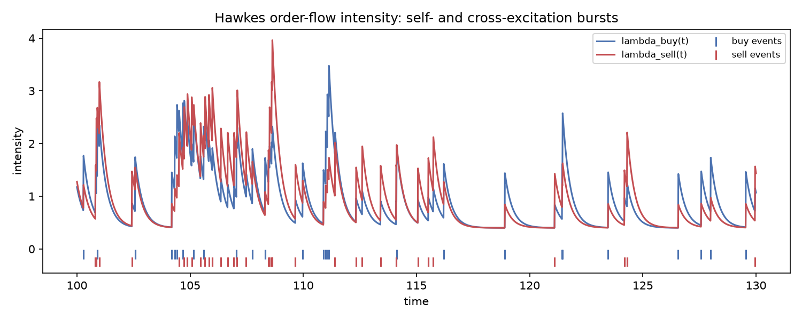
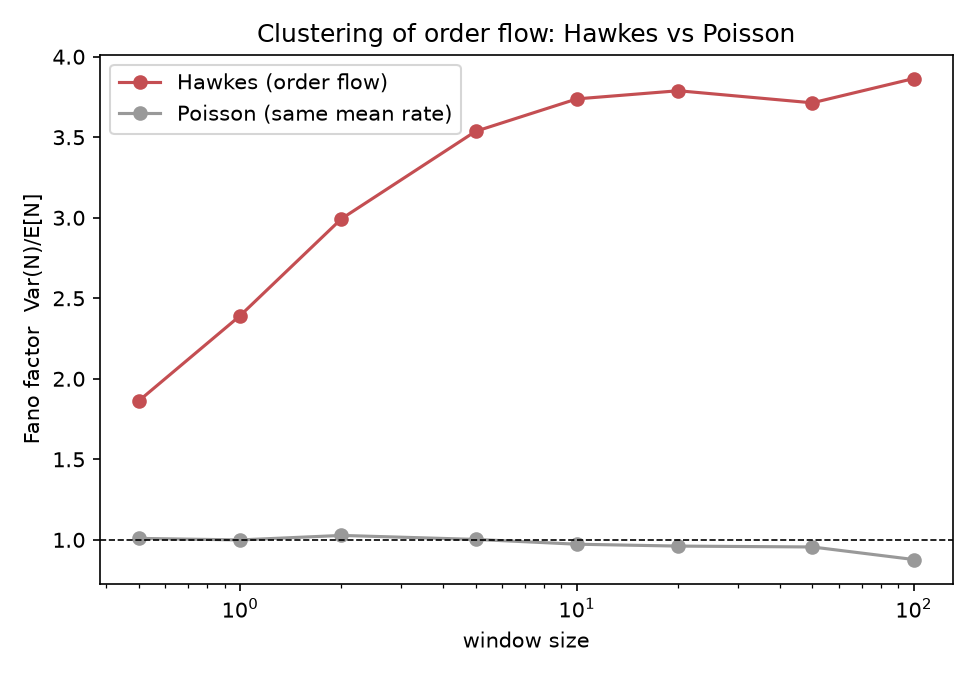

# Modélisation du carnet d'ordres par processus de Hawkes

**Langage : Python** (numpy/scipy — simulation exacte et vraisemblance
codées à la main, `scipy.optimize` uniquement pour l'optimisation
numérique finale du MLE).

## 1. Objectif

Modéliser l'arrivée des ordres marché (achat/vente) comme un
**processus de Hawkes multivarié auto- et mutuellement excitant**, pour
capturer deux faits stylisés bien documentés de la microstructure de
marché (Bacry, Mastromatteo & Muzy 2015).

À savoir : le **clustering** des arrivées d'ordres (une transaction en
déclenche d'autres à court terme), et l'**excitation croisée** entre
flux acheteur et vendeur.

## 2. Modèle — `hawkes.py`

Noyau exponentiel à décroissance **partagée** `β` entre toutes les
paires (source, cible), une simplification qui rend le calcul exact
tractable :

```
λ_m(t) = μ_m + Σ_n Σ_{t_k^n<t} α[m,n]·β·exp(−β(t−t_k^n))
```

`α[m,n]` = nombre moyen d'événements de type `m` directement
déclenchés par un événement de type `n` (matrice des ratios de
branchement).

Le processus est stationnaire ssi le **rayon spectral de α est < 1**,
auquel cas l'intensité moyenne stationnaire a une forme fermée :

```
Λ = (I − α)⁻¹ μ
```

### Astuce récursive (Bacry-Muzy 2015)

Comme `β` est partagé, toute la mémoire du noyau se réduit à un seul
vecteur, `R_n(t) = Σ_{t_k^n<t} exp(−β(t−t_k^n))`, mis à jour en `O(1)`
à chaque événement.

Simulation (**algorithme de thinning d'Ogata 1981**) et vraisemblance
exacte tournent donc en `O(N)`, pas `O(N²)`.

### Validations (bloc `__main__` de `hawkes.py`)

1. **Cas univarié** : taux d'événements empirique vs `Λ=μ/(1−α)`
   fermé, erreur **0.30 %** sur 25 000 événements simulés.
2. **MLE univarié** : récupère `(μ,α,β)=(0.5, 0.6, 2.0)` à partir des
   données simulées → `(0.516, 0.586, 2.061)`.

## 3. Application — flux d'ordres achat/vente — `experiment.py`

Modèle bivarié : auto-excitation sur chaque côté (momentum/herding),
plus excitation croisée (un achat peut déclencher des ventes, ex.
réaction de market-making).

`α = [[0.35,0.15],[0.15,0.35]]`, `β=3`, rayon spectral `0.5`,
`Λ_théorique=(0.8, 0.8)`, confirmé empiriquement à `15 000` unités de
temps (`0.799`, `0.800`).

### MLE sur le flux bivarié (24 000 événements)

| paramètre | vrai | recouvré |
|---|---:|---:|
| μ_achat | 0.400 | 0.398 |
| μ_vente | 0.400 | 0.413 |
| α_achat→achat | 0.350 | 0.355 |
| α_achat→vente | 0.150 | 0.147 |
| α_vente→achat | 0.150 | 0.142 |
| α_vente→vente | 0.350 | 0.343 |
| β | 3.000 | 2.967 |

Tous les paramètres, y compris l'asymétrie de la matrice de
branchement, sont recouvrés à quelques % près.



Les rafales sont visibles à l'œil : les deux intensités montent
ensemble (excitation croisée), puis retombent en `exp(−βΔt)` entre les
événements.

## 4. Résultat principal — le clustering mesuré par le facteur de Fano

Le **facteur de Fano** (indice de dispersion `Var(N(Δ))/E[N(Δ)]`)
compare le processus de Hawkes à un processus de Poisson homogène de
**même taux moyen**.

Un Poisson a par construction un facteur de Fano ≈ 1 à toute échelle ;
un processus sur-dispersé (regroupé en rafales) a un facteur > 1.

| fenêtre | Hawkes | Poisson (même taux) |
|---:|---:|---:|
| 0.5 | 1.86 | 1.01 |
| 2.0 | 2.99 | 1.03 |
| 10.0 | 3.74 | 0.97 |
| 100.0 | 3.86 | 0.88 |



Le processus de Hawkes reproduit exactement le fait stylisé recherché
: à taux moyen identique, ses arrivées sont **presque 4× plus
dispersées** qu'un Poisson, sur toutes les échelles testées, le
Poisson, par construction, restant à 1 partout.

## 5. Approche de la criticité

En augmentant le rayon spectral de `α` vers 1 (la borne de
stationnarité), clustering et taux moyen explosent tous les deux, de
façon spectaculaire :

| rayon spectral | Fano (fenêtre=5) | taux moyen |
|---:|---:|---:|
| 0.50 | 3.5 | 1.59 |
| 0.70 | 8.7 | 2.67 |
| 0.85 | 24.5 | 5.20 |
| 0.95 | 102.7 | 15.36 |
| 0.99 | 468.2 | 69.91 |

Ce régime quasi-critique n'est pas qu'une curiosité théorique : les
calibrations empiriques sur données réelles de flux d'ordres (futures,
actions) rapportent typiquement des ratios de branchement entre **0.5
et 0.9** (Bacry-Muzy 2015, Filimonov & Sornette 2012).

Les marchés réels opèrent structurellement **proches de cette
frontière**, ce qui explique en grande partie pourquoi le flux
d'ordres est si fortement auto-corrélé en pratique.

## 6. Limites assumées

- Décroissance `β` **partagée** entre toutes les paires (source,
  cible). Une extension naturelle est un noyau `β[m,n]` complet (perd
  la trajectoire récursive en `O(N)` sous cette forme simple, mais
  reste tractable avec un état récursif par paire plutôt que par
  dimension source).
- MLE par différences finies numériques (`scipy.optimize`, pas de
  gradient analytique), suffisant ici (7 paramètres, ~15 itérations)
  mais deviendrait lent avec plus de dimensions. Le gradient exact de
  la vraisemblance récursive est disponible en forme fermée dans
  Bacry-Muzy (2015), et serait l'étape naturelle suivante.

## 7. Structure du projet

```
.
├── README.md
├── requirements.txt
├── hawkes.py          # simulation (thinning d'Ogata) + vraisemblance récursive exacte + MLE, validations
├── experiment.py       # flux achat/vente, fit MLE, facteur de Fano, criticité
├── intensity_path.png
└── fano_factor.png
```

Reproduire :
```
pip install -r requirements.txt
python hawkes.py       # 2 validations (univarié)
python experiment.py   # application bivariée complète + graphiques
```

## 8. Sources

- Ogata, *On Lewis' simulation method for point processes*, IEEE
  Transactions on Information Theory 27(1), 1981
- Bacry, Mastromatteo & Muzy, *Hawkes Processes in Finance*, Market
  Microstructure and Liquidity 1(1), 2015, arXiv:1502.04592
- Bacry & Muzy, *Hawkes model for price and trades high-frequency
  dynamics*, Quantitative Finance 14(7), 2014, arXiv:1301.1135
- Filimonov & Sornette, *Quantifying reflexivity in financial markets:
  Toward a prediction of flash crashes*, Physical Review E 85, 2012
  (ratios de branchement proches de 1 sur données réelles)
