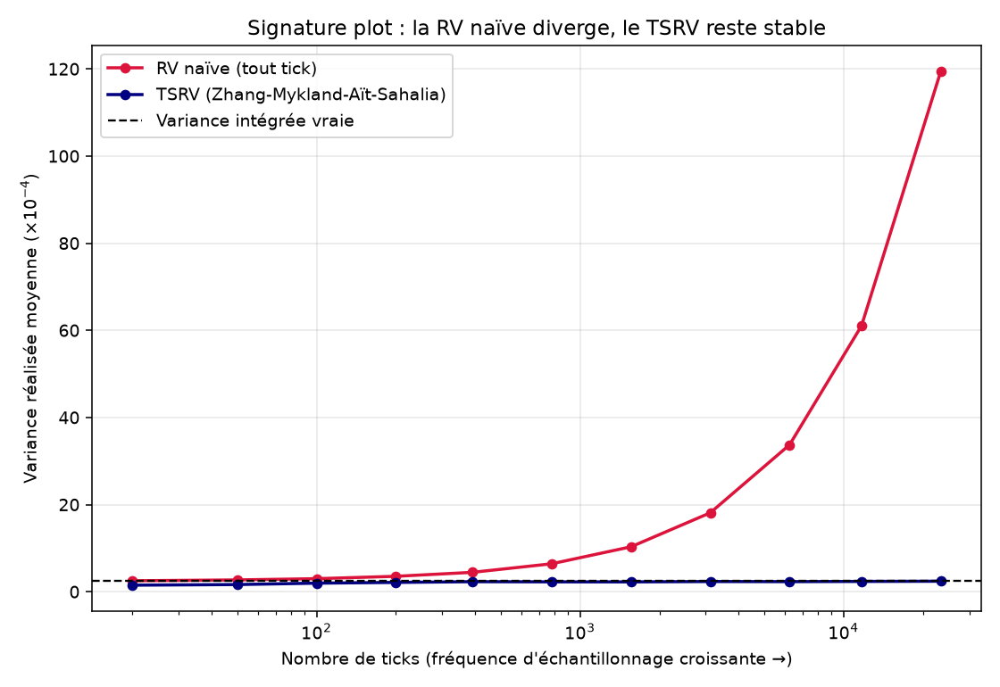
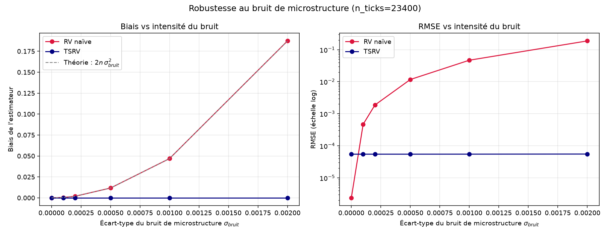

# Volatilité Réalisée Robuste au Bruit de Microstructure (Rust + Python)

Implémentation de l'estimateur **Two-Scale Realized Volatility (TSRV)** de
Zhang, Mykland & Aït-Sahalia (2005), comparé à l'estimateur de variance
réalisée "naïf" (tout tick), sur données haute fréquence simulées avec
bruit de microstructure. Extension directe du projet lead-lag existant
(Hayashi-Yoshida, Rust + `std::thread::scope`) : même style de code, même
approche de parallélisation, nouveau problème.

## Pourquoi ce projet

La variance réalisée "naïve" (somme des rendements au carré) est
l'estimateur manuel le plus intuitif de la variance intégrée, mais en
présence de bruit de microstructure (bid-ask bounce, décalages de
cotation), **elle diverge quand on échantillonne trop finement** : plus on
utilise de données, pire c'est. C'est un résultat contre-intuitif et
central en finance haute fréquence, illustré par le "signature plot".
Ce projet ne se contente pas de l'expliquer : il le **démontre
numériquement**, puis implémente et valide l'estimateur qui corrige ce
biais.

## Résultat principal le signature plot



À bruit fixé, en augmentant la fréquence d'échantillonnage de 20 à 23 400
ticks (~ 1 observation/seconde sur une séance) :
- la **RV naïve explose** : de 0.00026 à 0.0119 (~48x la vraie variance
  intégrée, 0.000248),
- le **TSRV reste stable**, entre 0.000168 et 0.000238, quelle que soit
  la fréquence.

## Validation quantitative du biais



Le biais de la RV naïve suit très précisément la loi théorique
`E[RV_naive] - IV ≈ 2n·σ²_bruit` (Zhang, Mykland & Aït-Sahalia, 2005) :
le ratio `biais / σ²_bruit` mesuré est **46 812**, contre `2n = 46 800`
attendu théoriquement, un écart de 0.03 %. Le biais du TSRV, lui, reste
quasi nul (~ -1.18×10⁻⁵) et **quasi constant** quel que soit le niveau de
bruit testé (de 0 à 0.002), preuve directe que la correction de biais
fonctionne comme prévu.

## Méthode

### Modèle de simulation
Log-prix GBM à volatilité constante (donc variance intégrée vraie connue
exactement : `IV = sigma² * T`), observé avec un bruit additif iid
(modèle standard ZMAS 2005) : `Y_i = X_i + epsilon_i`.

### Estimateur Two-Scale (TSRV)
```
TSRV = (1 - n̄/n)^-1 * [ RV_avg,K - (n̄/n) * RV_all ]
```
- `RV_all` : variance réalisée sur toute la grille ("échelle rapide",
  biaisée par le bruit).
- `RV_avg,K` : moyenne des variances réalisées sur K sous-grilles non-
  chevauchantes ("échelle lente", moins sensible au bruit).
- `K` choisi selon le taux asymptotiquement optimal `K* ~ n^(2/3)`
  (Zhang, Mykland & Aït-Sahalia, 2005), ce qui donne une convergence en
  `n^(-1/6)` au lieu de diverger.

### Parallélisation
Même approche que le projet lead-lag : `std::thread::scope`, un flux RNG
indépendant par thread (`StdRng` avec seed dérivé), buffers de résultats
découpés en tranches disjointes écrites sans verrou.

## Structure

```
src/
  simulate.rs      # Simulation GBM + bruit de microstructure
  estimators.rs     # RV naïve + TSRV (Zhang-Mykland-Aït-Sahalia)
  montecarlo.rs      # Runner parallèle (std::thread::scope)
  main.rs             # Deux expériences, export CSV
python/
  plot_results.py     # Signature plot + biais/RMSE, à partir des CSV Rust
Cargo.toml
outputs/               # Graphiques générés (commités : preuve visuelle pour le README)
```

## Compilation & usage

```bash
cargo build --release
./target/release/tier1_realized_vol      # génère signature_plot.csv et bias_rmse.csv

cd python && python plot_results.py       # génère les deux PNG dans outputs/
```

## Limites connues

- Le bruit de microstructure est simulé i.i.d. et indépendant du prix,
  en réalité, il est souvent auto-corrélé et corrélé au flux d'ordres
  (asymétrie achat/vente). Une extension naturelle serait de simuler un
  bruit AR(1) et de vérifier la dégradation de performance du TSRV.
- Un seul actif : le prochain prolongement logique est de combiner cet
  estimateur avec le projet lead-lag existant (Hayashi-Yoshida) pour
  estimer une **matrice de covariance réalisée** robuste au bruit sur
  plusieurs actifs asynchrones, la vraie brique utilisée en gestion de
  risque haute fréquence.
- `K* ~ n^(2/3)` avec constante 1 est un choix simple ; la constante
  optimale dépend en théorie du ratio signal/bruit réel, qu'on pourrait
  estimer empiriquement (voir ZMAS 2005, section sur le choix de K).